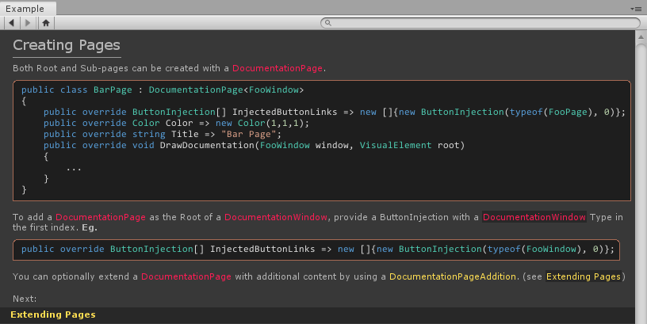

# nDocumentation
An extensible, searchable documentation window for the Unity Editor that displays rich text pages.

## 🚨 WORK IN PROGRESS AND HEAVILY EXPERIMENTAL 🚨

**Minimum Currently Supported Version : Unity 2019**

**2019.1.0a12 is not supported due to an issue with nested scroll views.**

**Currently recommended version: 2019.1.0a13**

----
## Intended Use Case
Editor tools spread over multiple packages can rely on an nDocumentation window for documentation inside of the Unity Editor.

If a Documentation Page was defined in a core package, a package with a reliance on it can add additions to that Page's content. This enables a minimal amount of coherent pages whilst maintaining a high amount of documentation.

## Documentation
The provided nDocumentationExample package is self documenting, and contains a window present in Window>Example Window. 

## Installation
Ensure your project is on .NET 4.x by navigating to Edit>Project Settings>Player>Configuration>Scripting Runtime Version and switching to .NET 4.x Equivalent.

Use the Package Manager (Window>Package Manager) and add the appropriate package.json files present in the root of each folder.

